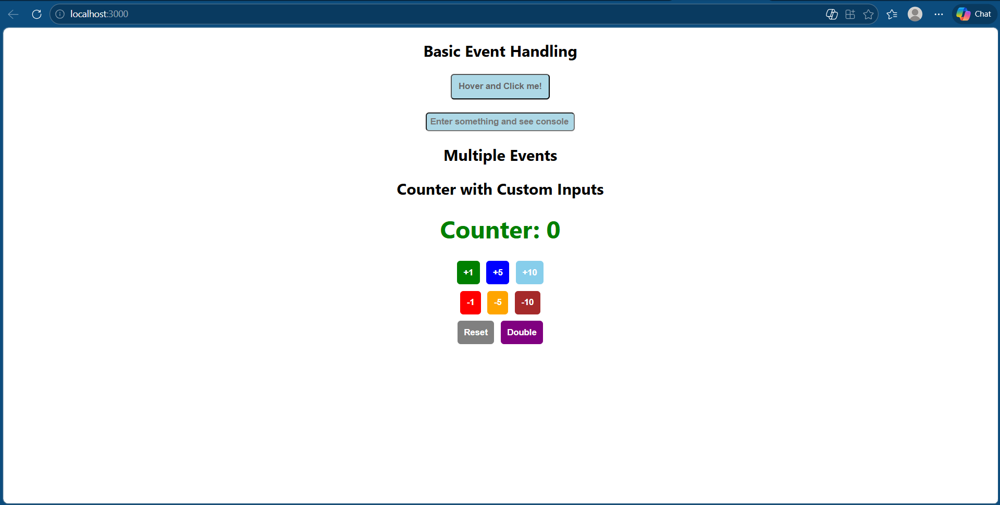
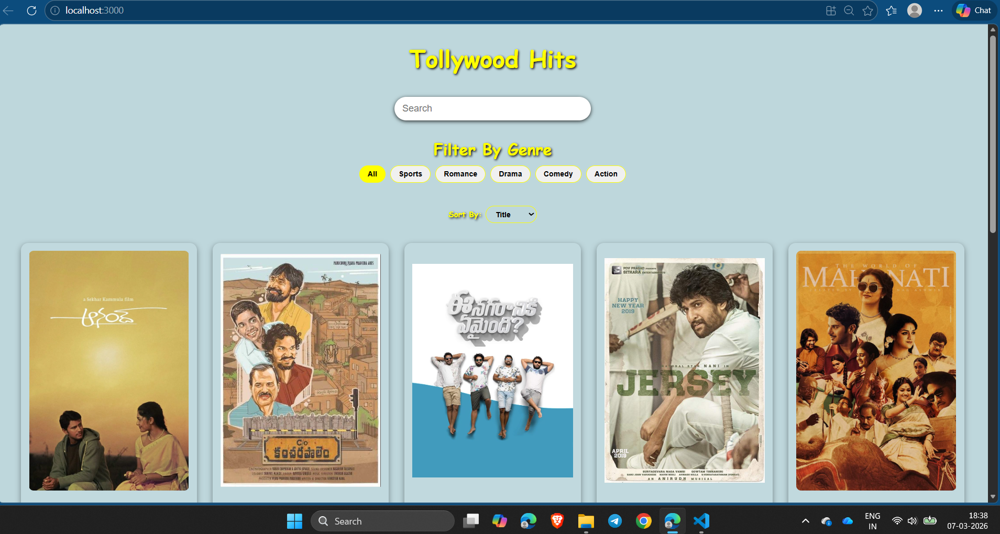

# React Mini Projects 


This repository contains a collection of **beginner-friendly React mini projects** created while learning the fundamentals of React.

Each project focuses on important React concepts such as:

* Components
* Props
* State
* Event Handling
* Styling Components

These projects helped me practice **building user interfaces using React** through small hands-on applications.

---

#  Projects

| Project                  | Folder                     |
| ------------------------ | -------------------------- |
| Event Handling           | `event-handling`           |
| Movie Database Interface | `movie_database_interface` |
| Portfolio Card Project   | `portfolio-card-project`   |
| Product Showcase         | `product-showcase`         |
| State Management         | `state_management`         |
| Styling React Components | `styling-react-components` |
| User Profile Dashboard   | `user-profile-dashboard`   |

---

#  Project Descriptions

### 1️ Event Handling




Demonstrates how React handles user interactions such as button clicks and input events.

**Concepts Practiced**

* Event handling
* Functional components
* Handling user input

---

### 2️ Movie Database Interface


A simple UI to display movie information in a structured format.

**Concepts Practiced**

* Component structure
* Rendering lists
* Layout design

---

### 3️ Portfolio Card Project

A reusable **profile card component** that displays user information such as name, description, and profile details.

**Concepts Practiced**

* React components
* Props
* Component-based UI design

---

### 4️ Product Showcase

Displays a list of products using reusable React components.

**Concepts Practiced**

* Component reuse
* Passing props
* Dynamic rendering

---

### 5️ State Management

Demonstrates how to manage and update component state using the **useState hook**.

**Concepts Practiced**

* useState
* State updates
* UI re-rendering

---

### 6️ Styling React Components

Explores different methods of styling React components.

**Concepts Practiced**

* CSS styling
* Component-level styles
* Layout design

---

### 7️ User Profile Dashboard

A dashboard interface that displays user profile information.

**Concepts Practiced**

* Component composition
* Layout structure
* Reusable components

---

#  Tech Stack

* React.js
* JavaScript (ES6)
* HTML5
* CSS3

---

#  Installation

Clone the repository

```
git clone https://github.com/GovindgeriNandini/react-mini-projects.git
```

Navigate to the project folder

```
cd react-mini-projects
```

Enter any project

```
cd event-handling
```

Install dependencies

```
npm install
```

Run the development server

```
npm start
```

---

#  Learning Goals

Through these projects I practiced:

* Building React components
* Passing props between components
* Managing state with hooks
* Handling events
* Styling user interfaces

---

#  Support

If you like this project, feel free to **star the repository**.
