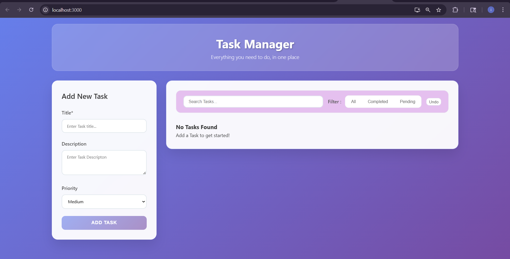
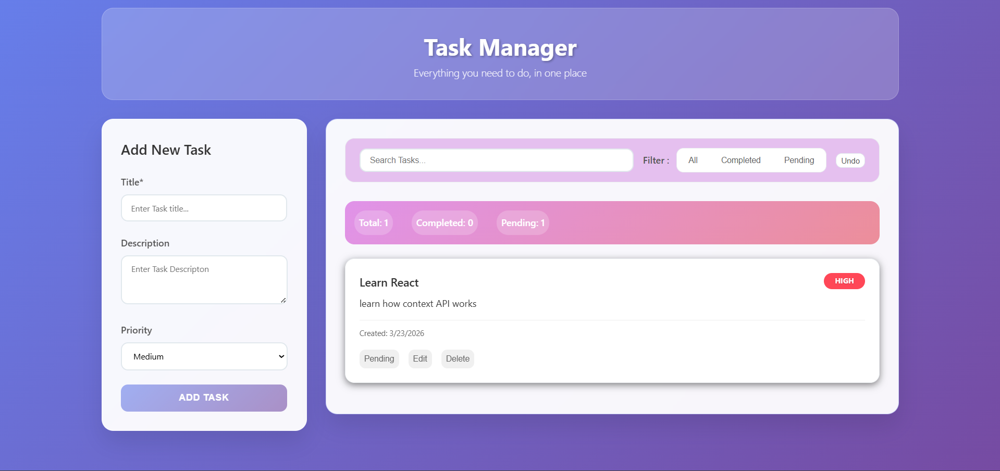
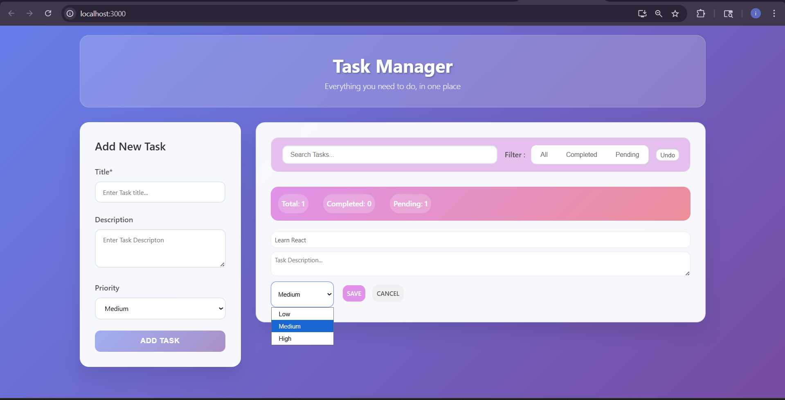

###  Task Manager

**Live Demo**
https://react-mini-projects-umber.vercel.app/






A full-featured task management app built with advanced React patterns.

**Concepts Practiced**

* Context API
* useReducer
* Global state management
* Component architecture
* Responsive design

#  Tech Stack

* React.js
* JavaScript (ES6)
* HTML5
* CSS3

---

#  Installation

Clone the repository

```
git clone https://github.com/GovindgeriNandini/react-mini-projects.git
```

Navigate to the project folder

```
cd react-mini-projects
```

Enter any project

```
cd event-handling
```

Install dependencies

```
npm install
```

Run the development server

```
npm start
```

---

#  Learning Goals

Through these projects I practiced:

* Managing global state with Context API
* Handling complex state logic with useReducer

---
